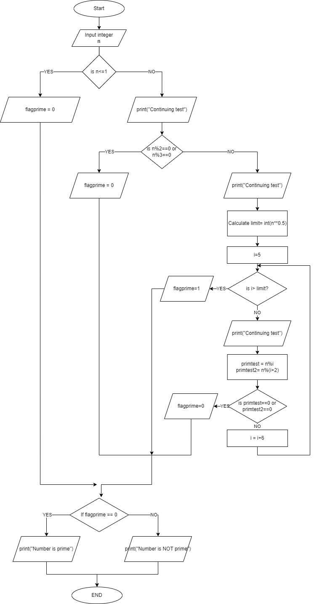

# Lab | Algorithmization

## Introduction

Find out how to convert the problem into the sequence of steps that will be further implemented in the code.

## Task 1

### Define if a given number is prime or not.
#### A prime number (or a prime) is a natural number greater than 1 that is not a product of two smaller natural numbers. Or, it is a natural number that can be divided only by 1 and itself.
#### PRIMALITY TEST
A primality is an algorithm for determinin if an input number is prime. Here we present the solution on the optimised method based on the idea that all integers can be expressed as $6k+i$.

An integer $n$ such that $n>1$ can be ruled as prime if $n=2$ or $n=3$. To test for primality we checked that the number $n$ is evenly divisible by any prime number between $2$ and $\sqrt{n}$, which has proven to be a faster test.

## Task 2
### Define the flowchart for the business case.
#### 
Supply Chain for Shipping 
* Financier - provides loans for the trades
* Buyer - should pay for the goods that should be delivered.

When the Financier has been approved by all counterparties, a collaboration space has been created so now the Financiers can bid on the trade, proposing the conditions for the Financial Agreement. 
The Finnacier can propose the conditions (such as the interest rate and a payback date) that will afterward be analyzed by the Buyer. In case the buyer does not agree with the financial terms, 
he can commit another counter proposal that will be then validated by the Financier or rejected.
Once the terms have been agreed by both parties, the agreed amount is locked until the confirmation of the success of the trade is received. 

