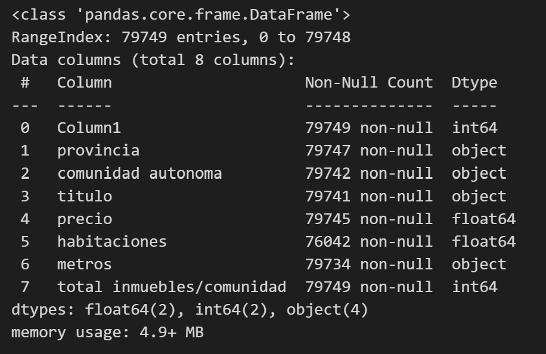
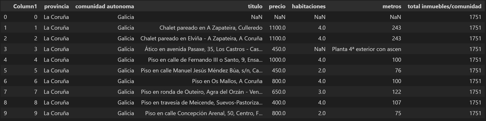
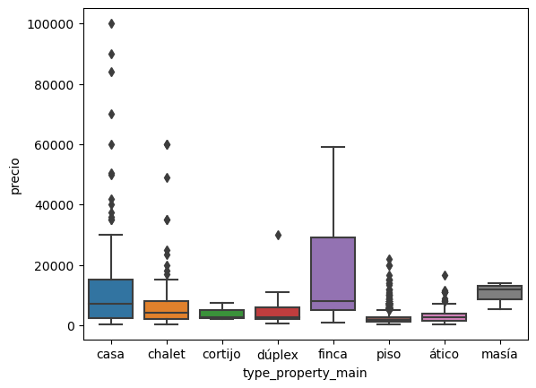
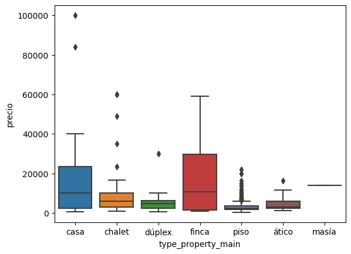
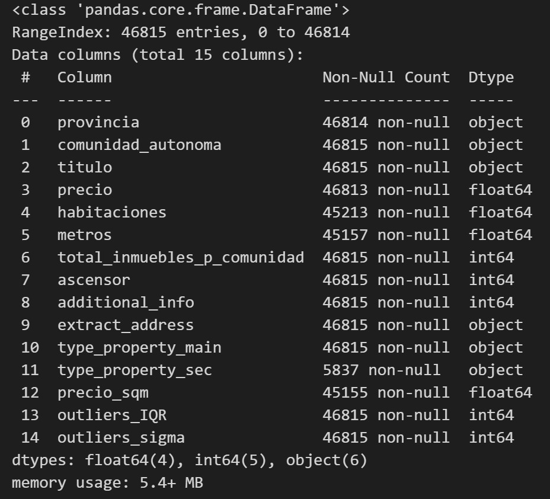
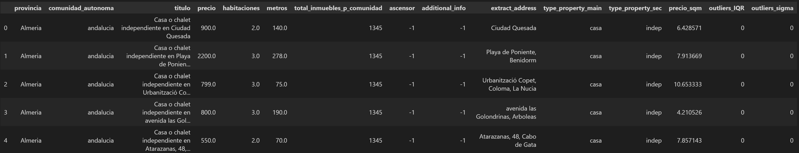

# Clean your data!
## Content
- [Project Description](#project-description)
- [Project Goals](#project-goals)
- [Technical Requirements](#technical-requirements)
- [Necessary Deliverables](#necessary-deliverables)
- [Presentation](#presentation)
- [Suggested Ways to Get Started](#suggested-ways-to-get-started)
- [Useful Resources](#useful-resources)

## Project Description

This project is based on the databased showing the rent prices of properties in Spain.
/!\ The DB did not included metadata about its origin or date of release.

---

## Project Steps

The following are a list of steps followed in this data cleaning project.

- Creating folder structure
- Downloading the data
- Cleaning the data base with Pandas
- Mysql processing
- Presentation

### Details of the data cleaning process 

The technical steps that were followed are:

* Import the data using Pandas.
* Examine the data for potential issues (missing data, data inconsistency, outliers, duplicates etc).
* Apply the different cleaning and manipulation techniques you have learned.
* Export clean version of your data into CSV file using Pandas.
* Check sqlalchemy library
* Export clean data into MySQL using Pandas.
* Prepare at least 3 tables analyzing the dataset in MySQL. Consider using ``group by`` statement for it.

## Deliverables

The following deliverables are located in this Github repo.
* **Raw excel** the original file containing the raw database [here](/data/10 -Spain renting.xlsx)
* **CSV file with clean data** containing the results of your data wrangling work [here](/output/clean_db.csv).
* **Python file: data_exploration.ipynb** containing all Python code and commands used in the importing, cleaning, manipulation, and exporting of your data set [here](/scripts/).
* **MySQL queries file: sql_alchemy.ipynb** containing the code to obtain table of your analysis [here](/scripts/).
* **Presentation slides** [here](https://docs.google.com/presentation/d/1bPut0WU39fLh2fgIVQV76G9lUr76MOoUJW5Dyl5m2zs/edit?usp=sharing)

## DB Highlights

The original database is composed of 7 columns as shown in the info panel:

The header shows that the first column `Column1` contains no information in addition, there are inconsistencies in the `metros` column and null values in multiple columns.

After cleaning the dataset we proceed to the idenfitication of outliers by two methods:
* **IQR range filter** Values outside of 1.5*IQR are considered outliers
* **3 sigma filter** Values outside of 3*standard deviation of the field are considered outliers

An example is shown below for the comparison of price against type of property using both methods:

 

The final product of the data cleaning and data wrangling is a databased composed of 14 columns derived from the original DB and with the delete of 40% of duplicated values

